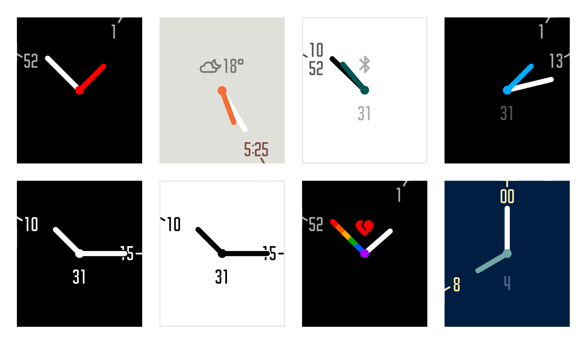

# minimalin 2

Minimalin 2 is a fork of the original Minimalin with minimal changes made to keep it working, as Rawgit, where the original config page was hosted, has since shut down.

Minimalin is a fully customizable watchface that blends analog and digital for a modern and elegant look.   
Minimalin uses Nupe, a custom font with numbers and icons, optimized with bitmap mapping to perfectly fit the pixel grid of the Pebble watch.

Some key features of Minimalin:
* Fully configurable colors
* Weather conditions and temperature
* Date display
* Steps from Pebble Health
* Low battery icon
* Bluetooth disconnected icon (pick your favorite)
* Rainbow hand :rainbow:

Go and grab it here (link to come).

## License

[MIT](LICENSE.md) for the code.
[OFL](design/font/LICENSE.md) for the Nupe font.

## Dependencies

* [Ractive](https://github.com/ractivejs/ractive/blob/dev/LICENSE.md)
* [Slate](https://github.com/pebble/slate/blob/master/LICENSE)

## Contributing
If you would like to contribute, that's awesome! But we would like you to follow these rules:

Check if an issue is already created for the issue/feature that you'd like to work on. If you'd like to work on a feature, please create an issue first and describe what you'd like to do. If your changes impact the design of the watchface or the configuration page, please provide designs and/or screenshots of your idea.
This way we'll be able to discuss the idea and see if it matches our vision before working on a PR.

## Credits

Thanks to [OpenWeatherMap](http://openweathermap.org/) for providing us with a free API key.

All credit goes to [Gringer Apps](https://github.com/GringerApps) for creating the original [Minimalin](https://github.com/GringerApps/minimalin). I definitely encourage anyone to drop them a donation [here](https://www.paypal.com/cgi-bin/webscr?cmd=_s-xclick&hosted_button_id=ZJYBKJHT2EXT4).
